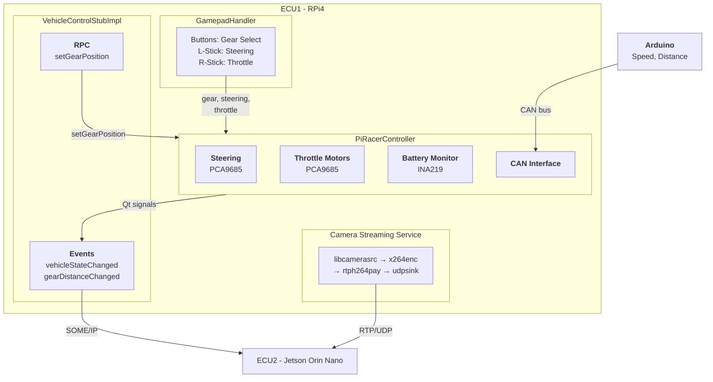
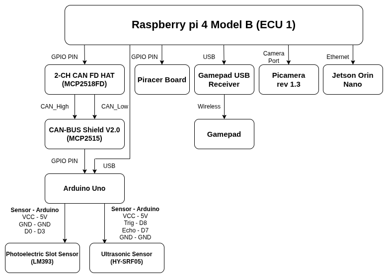

# **VehicleControl ECU**

---


# Introduction

The **VehicleControl ECU** is the hardware control unit (ECU1) of the DES_Head-Unit distributed automotive infotainment system, developed as part of the **SEA:ME** (Software Engineering for Automotive and Mobility Engineers) program.

Running on a **Raspberry Pi 4** with a custom **Yocto Linux** image, ECU1 has three distinct responsibilities:

1. **Physical Vehicle Control** — Motor actuation and steering via PCA9685 PWM controllers, battery monitoring via INA219, and gamepad input handling for manual driving
2. **Sensor Data Collection** — Receiving speed and distance data from an Arduino over CAN bus
3. **SOME/IP Service Provider** — Exposing vehicle state data (gear, speed, battery, distance) to ECU2 over Ethernet using the **vsomeip/CommonAPI** middleware stack, and accepting remote commands (e.g., gear change) from the head unit

Additionally, a separate **camera streaming service** runs independently on ECU1, streaming the picamera(OV5647 camera) feed to ECU2 via RTP/UDP using GStreamer.

The system is built around the **PiRacer AI Kit**, providing vehicle control with a gamepad interface, while exposing all vehicle state data as SOME/IP service events for consumption by the head unit(including PDC app) and instrument cluster applications on ECU2.

---

# Architecture

## Software Architecture



## Hardware Architecture



---

# Setting

## Raspberry Pi 4 Model B

- Raspberry Pi 4 Model B (4GB RAM)
- OV5647 Camera Module v1.3 (CSI interface)
- PiRacer AI Kit
  - PCA9685 PWM Controller @ I2C 0x40 (Steering servo, 50Hz)
  - PCA9685 PWM Controller @ I2C 0x60 (Throttle motors, 50Hz)
  - INA219 Current/Voltage Sensor @ I2C 0x41 (3S LiPo battery monitoring)
- Waveshare 2-CH CAN FD HAT (MCP251xFD via SPI)
- Shanwan USB Gamepad Controller
- Ethernet cable (direct connection to ECU2)
- MicroSD card (16GB+, flashed with Yocto image)

## Arduino UNO

- Photoelectric Slot Sensor (wheel encoder)
- HC-SR04 Ultrasonic distance sensor
- MCP2515 CAN Shield (1000 kbps, matching ECU1)
- CAN Frame ID: 0x0F6
  - Bytes 0-2: Speed (cm/s, big-endian int16 + decimal uint8)
  - Bytes 3-6: Distance (cm, little-endian float)

## Network Configuration btw two ECUs

| Device | Interface | IP Address | Role |
|--------|-----------|-----------|------|
| ECU1 (Raspberry Pi 4) | eth0 | 192.168.1.100/24 | SOME/IP Provider + Camera Sender |
| ECU2 (Jetson Orin Nano) | eth0 | 192.168.1.101/24 | SOME/IP Consumer + Camera Receiver |

---

# Usage

## Building the Yocto Image

```bash
# 1. Navigate to Yocto build directory
cd /path/to/yocto-build

# 2. Initialize build environment
source sources/poky/oe-init-build-env build

# 3. Build the VehicleControl ECU image
bitbake vehiclecontrol-image
```

## Flashing to SD Card

```bash
# 1.
lsblk

# 2. umount the sdcard
sudo umount /sdcard

# 3. flash image
sudo dd if=/path/to/yocto-build/build/tmp-glibc/deploy/images/raspberrypi4-64/vehiclecontrol-image-raspberrypi4-64.rpi-sdimg of=/dev/sda bs=4M status=progress conv=fsync

# 4. sdcard eject
sync
sudo eject /sdcard
```

## Verifying Services After Boot

```bash
# Check VehicleControl ECU service
systemctl status vehiclecontrol-ecu.service

# Check camera streaming service
systemctl status camera-streaming.service

# Check CAN interface
systemctl status can-setup.service
ip link show can0

# Check network connectivity to ECU2
ping -c 3 192.168.1.101

# View service logs
journalctl -u vehiclecontrol-ecu.service -f
journalctl -u camera-streaming.service -f
```

---

# Key Concept

## vsomeip & CommonAPI

### What is SOME/IP?

**SOME/IP** (Scalable service-Oriented MiddlwarE over IP) is an automotive middleware protocol standardized by AUTOSAR. It enables service-oriented communication between ECUs over standard Ethernet networks, replacing traditional signal-based CAN communication for high-bandwidth data exchange.

### Why vsomeip and CommonAPI?

In this project, the VehicleControlECU application on ECU1 handles physical vehicle control (motors, steering, battery) and collects sensor data from Arduino via CAN bus. It then acts as a **SOME/IP service provider**, exposing this vehicle state data (gear, speed, battery, distance) to any consumer on the network. ECU2 subscribes to these events to update its head unit and instrument cluster displays. Note that camera streaming is a separate systemd service — it does not go through SOME/IP.

1. **Service Discovery** — ECU2 automatically discovers ECU1's services via multicast, eliminating hardcoded addresses for service endpoints
2. **Event-based Communication** — Vehicle state changes are broadcast as events, allowing multiple consumers (GearApp, SpeedApp, BatteryApp, PDCApp) to subscribe independently
3. **RPC Methods** — ECU2 can call `setGearPosition()` on ECU1 remotely, enabling bidirectional control
4. **CommonAPI Abstraction** — FIDL interface definitions generate type-safe C++ proxy/stub code, decoupling application logic from the transport protocol

## Yocto Project

### What is the Yocto Project?

The **Yocto Project** is an open-source collaboration project that provides templates, tools, and methods to create custom Linux-based systems for embedded products. It uses **BitBake** as its build engine and **OpenEmbedded** as its build framework to cross-compile entire Linux distributions.

### Why Yocto for ECU1?

1. **Minimal Footprint** — The `vehiclecontrol-image` produces a ~512MB root filesystem containing only the packages needed for ECU1, unlike a full Raspberry Pi OS (~4GB)
2. **Reproducible Builds** — Every package version, kernel configuration, and system service is defined in recipes, ensuring identical builds across developers and CI/CD
3. **Custom Kernel Configuration** — Device tree overlays for OV5647 camera, MCP251xFD CAN controller, I2C sensors, and SPI are configured at the kernel level
4. **systemd Integration** — Services (vehiclecontrol-ecu, camera-streaming, can-setup) start automatically on boot with proper dependency ordering
5. **Cross-compilation** — All C++ applications, libraries (vsomeip, CommonAPI, pigpio), and GStreamer plugins are cross-compiled for ARM64 from an x86_64 host

### meta-vehiclecontrol Layer Structure

```
meta-vehiclecontrol/
├── conf/                              # Layer and machine configuration
├── recipes-bsp/                       # Boot configuration (config.txt, device tree)
├── recipes-core/                      # Image recipe, systemd network, udev rules
├── recipes-connectivity/              # vsomeip, CommonAPI, CAN setup, WiFi, SSH
├── recipes-kernel/                    # Kernel config (camera, CAN, Bluetooth modules)
├── recipes-multimedia/                # libcamera IPA fix, camera streaming service
├── recipes-support/                   # pigpio library
└── recipes-vehiclecontrol/            # VehicleControlECU application recipe
```

## libcamera & GStreamer

We used [libcamera](https://libcamera.org/) with GStreamer to stream the OV5647 reverse camera(picamera rev 1.3) from ECU1 to ECU2 over RTP/UDP. The default Yocto libcamera recipe only builds the `vimc` (virtual camera) IPA module, so we added a bbappend to build the Raspberry Pi IPA module instead:

```bitbake
# libcamera.bbappend
EXTRA_OEMESON:remove:rpi = "-Dipas=vimc"
EXTRA_OEMESON:append:rpi = " -Dipas=raspberrypi"

FILES:${PN} += "${libdir}/libcamera/*.so"
FILES:${PN} += "${libdir}/libcamera/*.so.sign"
```

The camera streaming runs as an independent systemd service on ECU1, using the following GStreamer pipeline:

**Sender (ECU1):**
```
libcamerasrc → videoconvert → x264enc (zerolatency) → rtph264pay → udpsink
```

**Receiver (ECU2):**
```
udpsrc → rtph264depay → h264parse → nvv4l2decoder → nv3dsink
```

## PiRacer Hardware Control

### What is PiRacer?

The **PiRacer** is an AI racing robot kit built around Raspberry Pi, using PCA9685 PWM controllers for motor and servo control, and I2C sensors for telemetry.

### Gamepad Input Mapping

| Input | Action |
|-------|--------|
| Button A | Gear: Drive |
| Button B | Gear: Neutral |
| Button X | Gear: Park |
| Button Y | Gear: Reverse |
| Left Stick X-axis | Steering (-1.0 to 1.0 : 100%)|
| Right Stick Y-axis | Throttle (0 to 1.0 : 50%, capped at 50%) |

### Gear Behavior

| Gear | Throttle Behavior |
|------|-------------------|
| Park (P) | All movement blocked |
| Reverse (R) | Backward only |
| Neutral (N) | All movement blocked |
| Drive (D) | Forward only |

---

# References

- [vsomeip](https://github.com/COVESA/vsomeip) — SOME/IP implementation by COVESA
- [CommonAPI C++ Core](https://github.com/COVESA/capicxx-core-runtime) — Language binding for automotive middleware
- [CommonAPI C++ SomeIP](https://github.com/COVESA/capicxx-someip-runtime) — SOME/IP binding for CommonAPI
- [Yocto Project](https://www.yoctoproject.org/) — Embedded Linux build system
- [libcamera](https://libcamera.org/) — Open-source camera stack for Linux
- [GStreamer](https://gstreamer.freedesktop.org/) — Open-source multimedia framework
- [pigpio](https://abyz.me.uk/rpi/pigpio/) — Raspberry Pi GPIO library
- [PCA9685 Datasheet](https://www.nxp.com/docs/en/data-sheet/PCA9685.pdf) — 16-channel PWM controller
- [INA219 Datasheet](https://www.ti.com/lit/ds/symlink/ina219.pdf) — Current/voltage monitor

---

# License

<!-- TODO: Choose and uncomment appropriate license -->
<!--
[](https://creativecommons.org/licenses/by-nc-sa/4.0/)

This work is licensed under a [Creative Commons Attribution-NonCommercial-ShareAlike 4.0 International License](https://creativecommons.org/licenses/by-nc-sa/4.0/).
-->
